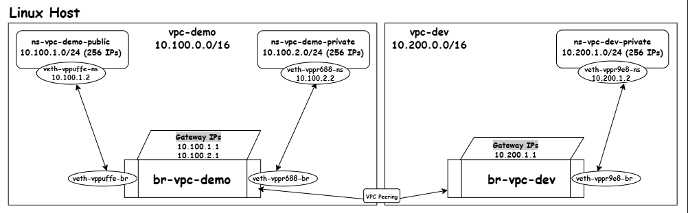

# vpcctl - A Tool for Building and Managing Virtual Private Clouds (VPCs) on Linux hosts

`vpcctl` is a Python CLI tool that builds a mini Virtual Private Cloud (VPC) on a single Linux host from first principles. It uses network namespaces, veth pairs, bridges, and `iptables` to simulate subnets (public/private), routing, NAT, security groups, and VPC peering.

This project was built to understand the underlying technologies that power cloud networking.

## Architecture

####Architectural Diangram



The architecture is built on standard Linux networking primitives:

* **VPC:** A "VPC" is implemented as a **Linux bridge** (`br-<vpc-name>`). It acts as the L2 switch and L3 router for all subnets within it. `iptables` rules on the host provide complete isolation between VPCs.
* **Subnet:** A "Subnet" is a **network namespace** (`ns-<vpc-name>-<subnet-name>`). This provides total process and network isolation.
* **Connection:** A **veth pair** ("virtual ethernet cable") connects each subnet (namespace) to its VPC (bridge).
* **Routing:** The host's kernel, with `net.ipv4.ip_forward=1`, provides routing. The bridge device is assigned the gateway IP for each subnet (e.g., `10.0.1.1`).
* **NAT Gateway:** A "public subnet" is simply a subnet whose CIDR has a `MASQUERADE` `iptables` rule that allows it to use the host's internet connection.
* **Security Group:** A "security group" is implemented as `iptables` rules on the `INPUT` chain *inside* the namespace, to provide a stateful, default-deny firewall.

## Prerequisites

1. You must be on a Linux host (e.g., an EC2 instance).

2. You will need the following packages installed:

* `python3` (v3.6+)
* `iptables` (provides the `iptables` command)
* `make` (for the Makefile)

**On a new Amazon Linux instance, run**

```bash
sudo yum install iptables make -y
```

## Installation

1. Clone the repository:

```bash
git clone https://github.com/cf-cloud89/vpc-builder.git
cd vpc-builder
```

2. Make the script executable:

```bash
chmod +x vpcctl.py
```

3. **IMPORTANT:** Edit the `Makefile` and set the `IFACE` variable to your host's main internet interface (e.g., `enX0`, `eth0`).
**Find your interface**

```bash
ip a
```

**Edit the Makefile**

```bash
vi Makefile
```

---
## Automated (Makefile) Validation Tests

This guide uses the `Makefile` for automating the VPC resources setup and cleanup. Run these tests in order

### Test 1: Core VPC, NAT & Routing

This test creates `vpc-demo` with a public and private subnet.

#### 1. Run Setup

```bash
sudo make setup
```

#### 2. Validation (NAT & Routing)

**Public NAT (Internet Access):**

```bash
sudo ip netns exec ns-vpc-demo-public ping -c 3 8.8.8.8
```

* **EXPECTED:** 0% packet loss. This proves the public subnet's NAT works.

**Private Subnet (No Internet):**

```bash
sudo ip netns exec ns-vpc-demo-private ping -c 3 8.8.8.8
```

* **EXPECTED:** 100% packet loss. This proves the private subnet is isolated.

**Inter-Subnet Routing:**

```bash
sudo ip netns exec ns-vpc-demo-private ping -c 3 10.100.1.1
```

* **EXPECTED:** 0% packet loss. This proves the private subnet can route traffic to the public subnet's gateway via the main bridge.

### Test 2: Security Group (Firewall)

This test applies a firewall rule to the private subnet to allow web traffic.

#### 1. Start the Server

First, manually start a web server _inside_ the private subnet:

```bash
sudo ip netns exec ns-vpc-demo-private python3 -m http.server 80 &
```

#### 2. Validation "Before" (Blocked)

Now, try to `curl` the server from the host. It will fail because the firewall's default policy is `DROP`.

```bash
curl --connect-timeout 2 http://10.100.2.2:80
```

* **EXPECTED:** `curl: (28) Connection timed out...`

#### 3. Apply Firewall Rules

Run the `make` target. This will create `policy.json` and apply the `ACCEPT` rule for port 80.

```bash
sudo make apply-firewall
```

#### 4. Validation "After" (Allowed)

Now that the firewall rule is applied, try to curl the server again.

```bash
curl http://10.100.2.2:80
```

* **EXPECTED:** Success. You will see the HTML output from the Python server. This proves the JSON policy was applied.

#### 5. Cleanup

This stops the **test server** (if running), deletes the **subnets** (public/private), deletes `vpc-demo`, and removes the `policy.json` file.

```bash
sudo make cleanup
```

### Test 3: VPC Isolation & Peering

This test uses the `make setup-peering` target to create two VPCs (`vpc-demo` and `vpc-dev`) and then guides you through manually testing isolation and applying the peering connection.

#### 1. Run Peering Setup

This command creates both `vpc-demo` (and its subnets) and `vpc-dev` (and its private subnet).

```bash
sudo make setup-peering
```

#### 2. Validation "Before" (Isolation)

Now, test that the VPCs are isolated. Try to ping from `vpc-demo` to `vpc-dev`. This will fail.

```bash
sudo ip netns exec ns-vpc-demo-private ping -c 3 10.200.1.1
```

* **EXPECTED:** 100% packet loss. This proves default isolation works.

### 3. Apply Peering

Manually run the `peer-vpc` command to connect them.

```bash
sudo ./vpcctl.py peer-vpc --vpc-a vpc-demo --vpc-b vpc-dev
```

### 4. Validation "After" (Peering)

Run the exact same ping test again.

```bash
sudo ip netns exec ns-vpc-demo-private ping -c 3 10.200.1.1
```

* **EXPECTED:** 0% packet loss. This proves peering is successful.

### 4. Cleanup

* To clean up the peering test (removes **both** VPCs):

```bash
sudo make cleanup-peering
```

## Manual Usage (Step-by-Step)

All commands must be run with `sudo`. The examples below build the same environment as `make setup`.

### 1. Create a VPC

This creates the bridge for your subnets.

```bash
sudo ./vpcctl.py create-vpc --name vpc-demo --cidr 10.100.0.0/16
```

### 2. Create Subnets

This creates namespaces and connects them to the VPC (bridge).

**Find your internet interface:** Run `ip a` and find your main interface (e.g., `enX0`, `eth0`).

**Example (Public):**

```bash
sudo ./vpcctl.py create-subnet --vpc vpc-demo --name public \
  --cidr 10.100.1.0/24 --type public --internet-iface enX0
```

**Example (Private):**

```bash
sudo ./vpcctl.py create-subnet --vpc vpc-demo --name private \
  --cidr 10.100.2.0/24 --type private
```

### 3. Apply Security Group Rules

Create a JSON file (e.g., `policy.json`) and apply it to the private subnet.
`policy.json`:

```json
{
  "vpc": "vpc-demo",
  "subnet": "private",
  "ingress": [
    {"port": 80, "protocol": "tcp", "action": "accept"},
    {"port": 22, "protocol": "tcp", "action": "deny"}
  ]
}
```

**Apply the policy:**

```bash
sudo ./vpcctl.py apply-rules --policy ./policy.json
```

### 4. Peer VPCs

This allows two different VPCs (and their subnets) to communicate.

```bash
# First, create a second VPC
sudo ./vpcctl.py create-vpc --name vpc-dev --cidr 10.200.0.0/16
sudo ./vpcctl.py create-subnet --vpc vpc-dev --name app \
  --cidr 10.200.1.0/24 --type private

# Create the peering connection
sudo ./vpcctl.py peer-vpc --vpc-a vpc-demo --vpc-b vpc-dev
```

### 5. Cleanup (Tear Down)

##### 1. Delete the peering

```bash
sudo ./vpcctl.py delete-peering --vpc-a vpc-demo --vpc-b vpc-dev
```

To prevent orphaned resources, **delete subnets** first, then the VPC.

##### 2. Delete the public subnet

```bash
sudo ./vpcctl.py delete-subnet --vpc vpc-demo --name public \
  --cidr 10.100.1.0/24 --internet-iface enX0
  ```

##### 3. Delete the private subnet

```bash
sudo ./vpcctl.py delete-subnet --vpc vpc-demo --name private \
  --cidr 10.100.2.0/24
``` 

##### 4. Delete the empty VPC

```bash
sudo ./vpcctl.py delete-vpc --name vpc-demo
```

## Validation Testing

### Test 1: Public & Private Subnets

**Test public subnet internet access**

```bash
sudo ip netns exec ns-vpc-demo-public ping -c 3 8.8.8.8
```

* **EXPECTED:** 0% packet loss

**Test private subnet internet access**

```bash
sudo ip netns exec ns-vpc-demo-private ping -c 3 8.8.8.8
```

* **EXPECTED:** 100% packet loss

### Test 2: Inter-Subnet Routing

This tests that subnets can talk to each other via the VPC router (the bridge).

From the private subnet, ping the public subnet's GATEWAY IP

```bash
sudo ip netns exec ns-vpc-demo-private ping -c 3 10.100.1.1
```

* **EXPECTED:** 0% packet loss

### Test 3: VPC Isolation & Peering

_(Assuming vpc-demo and vpc-dev are created)_
**From vpc-demo, try to ping vpc-dev's subnet gateway**

```bash
sudo ip netns exec ns-vpc-demo-private ping -c 3 10.200.1.1
```

* **EXPECTED:** 100% packet loss (Isolation works)

**Now, establish peering**

```bash
sudo ./vpcctl.py peer-vpc --vpc-a vpc-demo --vpc-b vpc-dev
```

**Try the ping again**

```bash
sudo ip netns exec ns-vpc-demo-private ping -c 3 10.200.1.1
```

* **EXPECTED:** 0% packet loss (Peering works)

### Test 4: Security Group (Firewall)

**Start a server in the 'private' subnet (IP will be 10.100.2.2)**

```bash
sudo ip netns exec ns-vpc-demo-private python3 -m http.server 80 &
```

**Try to curl it from the host**

```bash
curl --connect-timeout 2 http://10.100.2.2:80
```

* **EXPECTED:** Timeout (Default-deny works)

**Apply a rule to allow port 80**
_(create `policy.json` for vpc-demo/private first)_

```bash
sudo ./vpcctl.py apply-rules --policy ./policy.json
```

**Try to curl again**

```bash
curl http://10.100.2.2:80
```

* **EXPECTED:** Success (HTML output)
